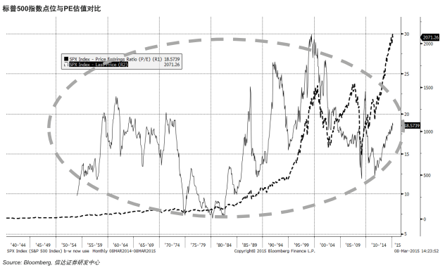

---
title: 夕会
author: 方莲
mode : selfcontained
framework: revealjs
hitheme : zenburn # tomorrow, zenburn
revealjs:
  theme: moon # c("sky", "beige", "simple", "serif", "night", "default", "solarized", "moon")
  transition: cube  #  c("cube", "page", "concave", "zoom", "linear", "fade", "none", "default")
  center: "true"
url: {lib: "."}
bootstrap:
  theme: amelia
# library(slidify)
# setwd("G:/slidify/Windows/revealjs")
# slidify('20150313.Rmd', encoding='UTF8')
--- 

<style>
.reveal h1 {
  text-shadow: 0 1px 0 #cccccc, 0 2px 0 #c9c9c9, 0 3px 0 #bbbbbb, 0 4px 0 #b9b9b9, 0 5px 0 #aaaaaa, 0 6px 1px rgba(0, 0, 0, 0.1), 0 0 5px rgba(0, 0, 0, 0.1), 0 1px 3px rgba(0, 0, 0, 0.3), 0 3px 5px rgba(0, 0, 0, 0.2), 0 5px 10px rgba(0, 0, 0, 0.25), 0 20px 20px rgba(0, 0, 0, 0.15); }

.reveal h1 { font-size: 2.5em; }

/*
.reveal h2 {
    color: #CC2904;
    text-align: left;
    padding-bottom: 10px;
    font-family: 'Open Sans Condensed', 'Trocchi', sans-serif;
    font-size: 52px;
    font-weight: bold;
}
*/

.reveal h3 {
    text-align: left;
}

.reveal h2 {
  line-height: 1;
  -webkit-box-reflect: below -0.556em -webkit-gradient(linear, left top, left bottom, from(transparent), 
          color-stop(0.3, transparent),  /*重叠长度*/
          color-stop(0.7,  /*重叠长度*/
          rgba(255, 255, 255, 0.25)),  /*浓度*/
          to(transparent));
  -moz-box-reflect: below -0.556em -moz-linear-gradient(top, transparent 0%, transparent 30%, rgba(255, 255, 255, 0.3) 100%);
}

.reveal h3 {
  line-height: 1;
  -webkit-box-reflect: below -0.556em -webkit-gradient(linear, left top, left bottom, from(transparent), 
          color-stop(0.3, transparent),  /*重叠长度*/
          color-stop(0.7,  /*重叠长度*/
          rgba(255, 255, 255, 0.25)),  /*浓度*/
          to(transparent));
  -moz-box-reflect: below -0.556em -moz-linear-gradient(top, transparent 0%, transparent 30%, rgba(255, 255, 255, 0.3) 100%);
}


.reveal.cube .slides section:not(.stack):before {
  box-shadow: 0 0 50px #c0c0c0;
	-moz-border-radius: 20px;
	-webkit-border-radius: 20px;
	border-radius: 20px;
  -moz-background-clip: padding;
  -webkit-background-clip: padding-box;
	background-clip: padding-box;
}

</style>

```{r results='hide', echo=FALSE, warning=FALSE, message=FALSE}
library(WindR)
w.start()
require(quantmod)
library(ggplot2)
library(reshape2)
```


```{r warning=FALSE, echo=FALSE, results='hide', message=FALSE}
options(width = 80, scipen = 6, digits = 3)
options(replace.assign = TRUE)
pdf.options(family='GB1')
```

```{r  echo=FALSE, warning=FALSE, fig.width=15}
stock.daily.plot <- function(stock.code, stock.name, from=Sys.Date()-90, to=Sys.Date()){
  ##-----------------------------------------------
  ## Theme: white
  theme.white <- chartTheme("white")
  names(theme.white)
  theme.white$bg.col <- "white"
  theme.white$up.col <- "red"
  theme.white$dn.col <- "green"
  
  ## Theme: black
  theme.black <- chartTheme("black")
  names(theme.black)
  theme.black$bg.col <- "black"
  theme.black$up.col <- "red"
  theme.black$dn.col <- "green"
  ##-----------------------------------------------
  ## main 
  ##
  STOCK.CODE.WindR <- function(ticker){
    if(substr(ticker, 1, 1) == 0|3)
      TICKER <- paste(substr(ticker, 1, 6),".SZ", sep="")
    if(substr(ticker, 1, 1) == 6)
      TICKER <- paste(substr(ticker, 1, 6),".SH", sep="")
    return(TICKER)
  }
  ##
  ticker.daily <- stock.code
  ###
  Sec.inf <- w.wss(ticker.daily,'sec_name')
  ##
  stock.name <- paste(Sec.inf$Data$SEC_NAME,Sec.inf$Data$CODE, sep=" ")
  ticker.daily <- w.wsd(ticker.daily,"open,high,low,close,volume",from, to,"adjDate=0;ndays=5;Fill=Previous;priceAdj=F")
  ticker.daily <- ticker.daily$Data
  ticker.daily <- xts(ticker.daily[,-1], ticker.daily[,1]) 
  ##
  chartSeries(ticker.daily, theme = theme.white,
              TA = "addVo()", # addMomentum(); addROC()
              name = stock.name
  )
}
```

<!--: Beginning ----------------------------------------------------------------------------------------------->

# 大象「如何」起舞
<h4>金顾中心</h4>

<small> [方莲](http://williamlfang.github.io/) </small>

<script src="http://ajax.googleapis.com/ajax/libs/jquery/1.9.1/jquery.min.js"></script>


--- &twocolumns

## 反弹？反转？

*** =left
```{r,  echo=FALSE, warning=FALSE}
stock.daily.plot("000300.SH")
```

*** =right
```{r,  echo=FALSE, warning=FALSE}
stock.daily.plot("399006.SZ")
```

*** =fullwidth

--- 
```{r,  echo=FALSE, warning=FALSE, fig.width=12}
stock.daily.plot("002142.SZ", from="2014-11-01")
```


--- 
```{r,  echo=FALSE, warning=FALSE, fig.width=12}
stock.daily.plot("300104.SZ", from="2014-11-01")
```


--- 
## 躁动的A股

.fragment 进入 2015 年，A 股市场分化明显

> - 沪指震荡回落，逼近 3000 点整数关口
> - 而创业板指则突飞猛进，连创历史新高

<br><p></p><br>

.fragment 在此期间，概念板块炒作持续活跃

> - 环保概念：穹顶之下引发的暴动
> - 国资改革：上海板块
> - 互联网金融：回锅肉
> - 两会题材

<script>
$('ul.incremental li').addClass('fragment')
</script>

--- ds:green 

# 「结构性」行情

.fragment 综合指数暂时失效

> - 创业板可能继续走高，但动能已变弱：惯性动能
> - 主板中线具备投资价值：均值回复过程
> - 行业内个股分化明显：关注年报披露
> - 适当布局二线蓝筹与滞涨股：消灭低估值
> - 互联网+：车联网，智能工业，智慧医疗
> - 留一半清醒

<script>
$('ul.incremental li').addClass('fragment')
</script>

--- *** ds:red &twocolumns

## 市梦率？

*** =left
```{r,  echo=FALSE, warning=FALSE}
stock.daily.plot("600519.SH")
```

*** =right
```{r,  echo=FALSE, warning=FALSE}
stock.daily.plot("300359.SZ")
```

--- ds:orange &vertical

*** ds:orange


*** ds:blue


--- ds:indigo

# 「会」投资

### 投资机会

.fragment 两会期间被轮番爆炒，热词抢占A股前沿

> - 环保是一个「大产业」： 支柱产业定位，环保行业政策
> - 国资改革：全面推进
> - 互联网+：不仅是改造传统产业，而是「重造」整个生态
> - 工业4.0：中国制造2025
> - 政策为经济兜底：基建、地产、有色、金属

<script>
$('ul.incremental li').addClass('fragment')
</script>


