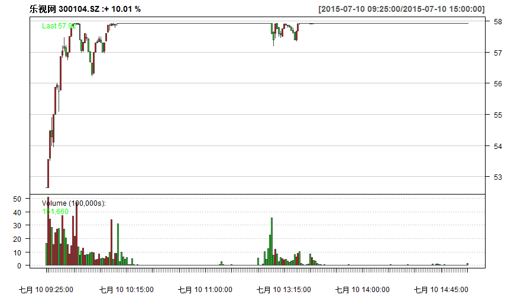

---
title: 沪港通
author: 方莲
mode : selfcontained
framework: revealjs
hitheme : zenburn # tomorrow, zenburn
revealjs:
  theme: moon # c("sky", "beige", "simple", "serif", "night", "default", "solarized", "moon")
  transition: cube  #  c("cube", "page", "concave", "zoom", "linear", "fade", "none", "default")
  center: "true"
url: {lib: "."}
bootstrap:
  theme: amelia
# library(slidify)
# setwd("G:/slidify/Windows/revealjs")
# slidify('20150403.Rmd', encoding='UTF8')
--- 

<!--: Beginning ----------------------------------------------------------------------------------------------->

# 孔雀東南飛
<h4>金顧中心</h4>

<small> [方蓮](http://williamlfang.github.io/) </small>

--- &twocolumns

## 非理性繁荣

*** =left
 

*** =right
 

--- ds:brown &vertical 

## 市啥率，就是啥率
.fragment 

> - 好朋友问及我如何评估中国市场的估值。我答道：“用市盈率及市净率，”并续道：“现在两个比率已经非常高了。”
> - 好朋友笑道：“哎呀，亲爱的，你难道有没有听说过市梦率，市胆率，甚至市傻率吗？”
> - 我被他逗乐了，并顺势举行茶杯喊道：“那我们就为市啥率干杯吧！”
> - “你显然未醉。”友人走过来牵着我的手臂道：“我们其他人都喝酒，你这样的独醒的状态，不会尽兴的。”
> - 我只好从了，和大家一醉方休。

*** ds:indigo
## 凯恩斯
> 没有什么比在一个非理性的世界追求一个理性的投资策略更具有毁灭性。

*** ds:green
 

*** ds:green
 

*** ds:brown
## 增量资金是动能

*** ds:indigo
## 巴菲特
> 別人恐懼時我們貪婪，
>  
> 別人貪婪時我們恐懼。

*** ds:blue
## 梦醒时分
.fragment 海通：二季度 A 股市场风格有望切换到蓝筹板块

> - 中小市值股票“市梦率”式的炒作不可持续；
> - 相对较高的信用交易杠杆将促发 A 股市场风格切换的速度；
> - 退市制度的实质推进，注册制的深入，未来“良币驱逐劣币”时代即将到来
> - 绩优蓝筹板块和个股将获得市场的青睐。 

--- &twocolumns
## 投资简单的事
*** =left

> - 89
> - 11
> - =  100 

*** =right
> - 49
> - 11
> - =  60 

*** =fullwidth

.fragment 
> -   12.359550561 
> -  22.448979591 

--- &twocolumns
## 最遥远的距离
*** =left

*** =right

--- &vertical
## 最遥远的距离
.fragment 
> - 沪股通上涨58%
> - 港股通仅5%
> - 

*** ds:orange
## 香港最便宜

*** ds: indigo
## 行业前向市盈率对比

*** ds: brown
## 行业前向市净率对比

--- ds:blue &vertical

## 港A化

*** ds:brown
## 港A化

*** ds:red
## 孔雀東南飛
.fragment 
> - 香港作为全球估值洼地的吸引力不断上升
> - 公募基金和险资开放，资金南下趋势明显
> - 

--- &twocolumns
## 北水南调
*** =left
 <h4> 近期沪股通连续净抛售</h4>

*** =right
 <h4> 港股通则持续净买入</h4>

--- ds:red
## 下一站，香港

--- &vertical

## 港股通投资策略

.fragment 几类优质公司有望获得新资金关注 
> - 沪港通范围内，市值在 200 亿以下的低估值公司； 
> - H 股明显折价的 A+H 类公司； 
> - 在沪港通范围外，但具有 A 股认可概念的小市值公司。

*** ds:indigo

*** ds:orange

*** ds:brown
 

*** ds:green
 

--- 
# 金港快线
<h4>金顧中心</h4>

<small> [方蓮](http://williamlfang.github.io/) </small>

--- &vertical
## 全景扫描
.fragment 覆盖广阔，标的稀缺
> - 可以进行港股通交易的合资格股票  ? 
> -  284 
> - 17
> - 26%
> - 80%
> -  10.2 

*** ds:brown
## 投资逻辑
.fragment 
> - 直接受益于资本市场制度红利的券商行业
> - AH 股折价率:两地估值溢价。主要是 TMT 类小市值个股
> - 稀缺性:市值结构。对于港股来说，优质的 TMT 类公司具备一定的稀缺性
> - 股息分红:两地风格偏好。外部投资者偏好于高分红低估值且业绩相对稳定的资产
> - 产业竞争力:全球视角
> - <h4> 一言以蔽之：真正的价值投资！！！</h4>

--- &twocolumns
## 产品服务化设计

*** =left
.fragment <h4>  资讯类   </h4>

> - 每日投资要闻
> - 港股投资建议
> - AH两市联动
> - 海外市场述评

*** =right
.fragment  <h4>  策略类  </h4>

> - 行业分析供稿
> - 潜力板块追踪
> - 深度价值挖掘
> - 高端理财服务

--- ds:red &vertical
### 神州租车：移动出行入口
 

*** ds:brown
### 四环医药：先进新药研制
 

*** ds:indigo
### 腾讯控股：社交平台龙头
 

--- 

> - Tel：5393093
> - 微信：william_fang

--- ds:red

